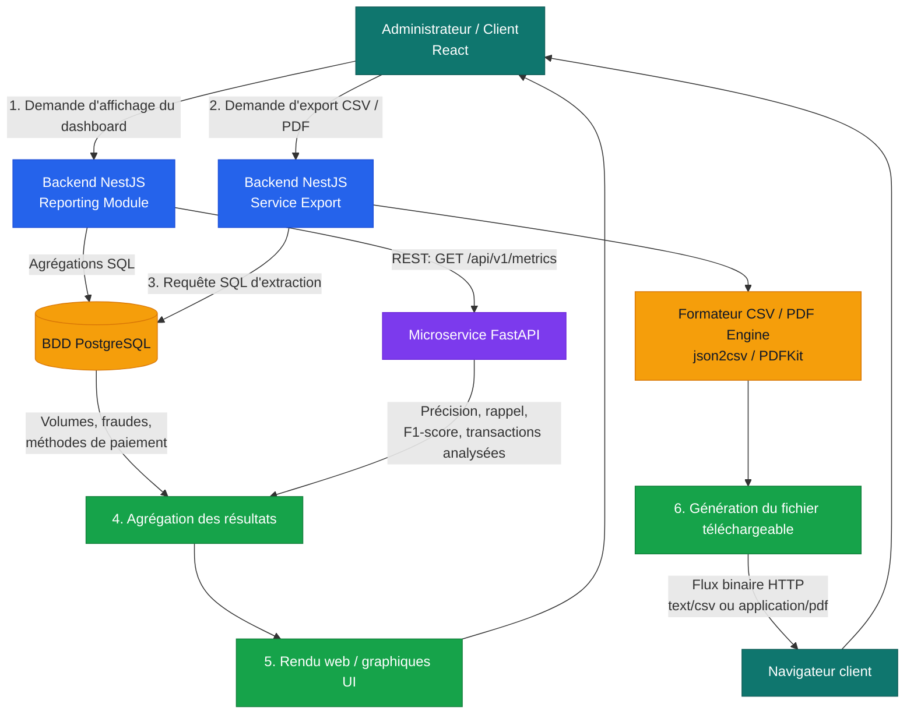

# Diagramme du workflow Analytics & Reporting

## Vue d'ensemble

## Étapes détaillées du workflow

### 1. Agrégation et calcul des données métiers

**Objectif :** fournir rapidement les indicateurs du dashboard.

- L'administrateur ou le client ouvre le tableau de bord Analytics.
- Le module Reporting de NestJS exécute des requêtes PostgreSQL optimisées avec `GROUP BY`, `SUM` et `COUNT`.
- Les agrégations compilent les volumes financiers par canal : Mobile Money, carte, virement et QR.
- Les statuts des opérations et les alertes de fraude sont regroupés pour alimenter les KPIs.
- Les index PostgreSQL sur les colonnes filtrées et groupées réduisent le temps de réponse.

### 2. Interrogation du service IA FastAPI

**Objectif :** mesurer les performances de la détection de fraude.

- NestJS effectue un appel REST synchrone vers `GET /api/v1/metrics`.
- FastAPI calcule ou restitue les métriques globales du modèle XGBoost / Random Forest.
- La réponse contient la précision, le rappel, le F1-score et le nombre total de transactions analysées.
- NestJS normalise cette réponse avant de la fusionner avec les agrégations PostgreSQL.

### 3. Affichage et mise à jour des graphiques React

**Objectif :** restituer les données consolidées dans l'application web.

- Le frontend React reçoit les données du module Reporting.
- Les indicateurs clés sont mis à jour dynamiquement.
- Les graphiques présentent l'évolution temporelle des flux, la répartition par canal et les alertes d'anomalies.
- L'interface affiche un état de chargement et un état d'erreur si PostgreSQL ou FastAPI ne répond pas.

### 4. Demande d'exportation d'un rapport CSV ou PDF

**Objectif :** permettre l'export de l'historique d'un client ou des registres globaux.

- L'utilisateur sélectionne la période, le périmètre et le format de sortie.
- Le contrôleur du Service Export valide les paramètres et les droits d'accès.
- NestJS exécute la requête SQL correspondant au sous-ensemble demandé.
- Le moteur `json2csv` génère le CSV ou `PDFKit` génère le PDF à la volée.

### 5. Distribution du fichier téléchargeable

**Objectif :** transférer le rapport de manière sécurisée.

- NestJS renvoie le document comme flux binaire HTTP.
- Le type MIME est défini selon le format : `text/csv` ou `application/pdf`.
- Les en-têtes `Content-Disposition` indiquent au navigateur le nom du fichier.
- Le navigateur déclenche le téléchargement direct sur le poste de l'utilisateur.

## Découpage du sprint

| Lot | Travail | Critère d'acceptation |
| --- | --- | --- |
| Analytics backend | Créer le module Reporting et les agrégations PostgreSQL indexées | Les KPIs par canal et statut sont retournés par une API NestJS |
| Intégration IA | Connecter NestJS à `GET /api/v1/metrics` | Les métriques précision, rappel, F1-score et volume sont visibles |
| Dashboard React | Brancher le contrôleur dashboard aux données consolidées | Les KPIs et graphiques se mettent à jour avec des états de chargement/erreur |
| Export | Ajouter l'extraction et la génération json2csv / PDFKit | Un utilisateur autorisé télécharge un CSV ou un PDF valide |
| Sécurité et validation | Contrôler les rôles, paramètres, MIME et erreurs de service | Aucun export n'est accessible hors du périmètre autorisé |